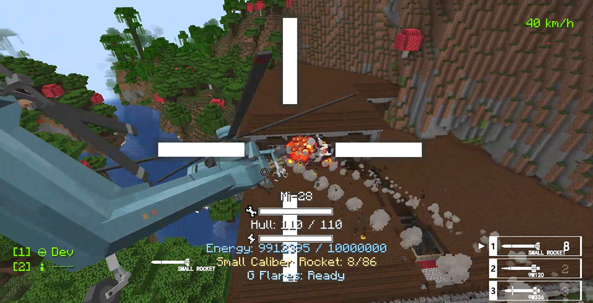
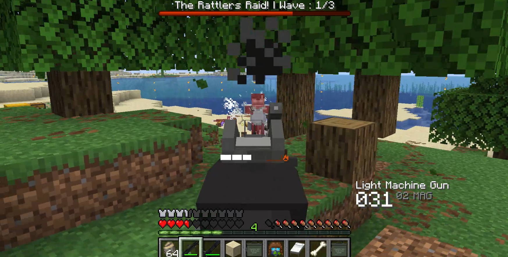
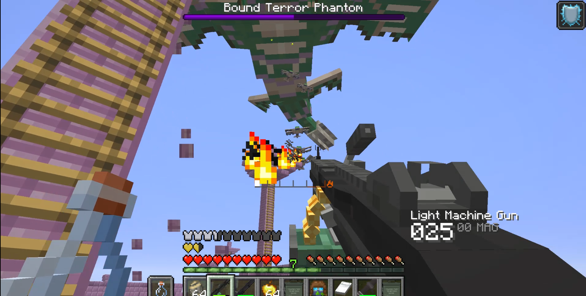

# Just Enough Guns New

A modern fork and unofficial port of the Forge 1.20.1 mod Just Enough Guns, bringing vanilla-styled firearms, hostile gunners, faction raids, vehicles, and late-game aerial threats to newer Minecraft versions.



Just Enough Guns New is based on the original Just Enough Guns project for Forge 1.20.1. This fork unofficially ports and continues that gameplay work on modern Fabric and NeoForge versions while keeping the Minecraft-friendly visual style. Weapons use survival crafting progression, magazines, attachments, recoil, spread, overheating, ammo HUD feedback, and server-side combat logic. The current 1.7.1 builds move the maintained Java 25 line to Minecraft 26.2 while carrying forward repair-kit anvil repair, localization cleanup, vehicle explosive tuning, first-person gun camera sway, gun inspect animations, and focused vehicle and helicopter fixes.

## Screenshots





## Highlights

- Broad firearm lineup: pistols, revolvers, rifles, SMGs, shotguns, machine guns, launchers, bows, flamethrower-style weapons, and special late-game guns.
- Survival progression: workbenches, ammo, magazines, attachments, skins, and repair items.
- Modern gun handling: left-click shooting, right-click aiming, magazine reloads, recoil, movement spread, dynamic crosshair expansion, hit markers, muzzle effects, and bullet trails.
- Extended magazine system: base, extended, and drum magazines for supported rifle, SMG, and shotgun reloads.
- Forge-style melee support: V-key gun melee, flashlight toggles, sword bayonet damage, and first-person melee or bayonet animations for animated guns.
- Animated gun inspection on the Y key for held animated guns.
- Walkürenritt vehicle warfare: assembled land vehicles, boats, aircraft, helicopters, fixed weapon platforms, vehicle inventories, repair tools, charging support, missiles, decoys, and dedicated vehicle HUDs.
- Hostile gunner mobs: zombie-family, skeleton-family, piglin-family, pillager/vindicator, phantom, ghoul, and parched gunner variants.
- Faction encounters: patrols, faction omen flow, home-triggered raids, raid flares, boss bars, configurable raid waves, and faction-specific blueprint rewards.
- Terror Phantom content: rare sky threat, Bound Terror Phantom guardian variant, phantom gunner summons, configurable death explosions, and End Ship Armada structure encounters.
- Defensive gear: bulletproof helmets and vests, plus armored Joy Harness upgrades.
- Server configuration: tune gunners, raids, UI visibility, dynamic crosshair, hit feedback, Terror Phantom behavior, spread, explosions, vehicles, and other combat systems.

## Latest Release Notes

Version `1.7.1` is the current release line. It keeps the 1.7.0 magazine-fed weapon and Walkürenritt vehicle work, then adds maintenance fixes and the maintained 26.2 unofficial ports.

- Added maintained Fabric 26.2 and NeoForge 26.2 branches; Fabric 26.1 and NeoForge 26.1 are now legacy maintenance/reference lines.
- Restored the `jeg:repair_kit` recipe and made the repair kit the anvil repair material for guns and bulletproof armor.
- Fixed repair kit behavior so it no longer repairs vehicles on right-click; repair tools still repair vehicles.
- Added first-person held-gun left/right movement camera sway.
- Fixed Fabric 1.21.1 custom reload key handling and Flamethrower reload timing.
- Reduced rocket and missile block damage and splash reach on direct vehicle hits while preserving direct vehicle damage.
- Fixed MI-28 gunner pitch limits and 26.2 vehicle assembly preview entity IDs.
- Fixed Magazine Loader placement orientation, inventory tooltip rendering, block textures, and container drops when broken.
- Added Y-key gun inspect animations and updated helicopter unsafe-descent, crash-damage, rotor, warning HUD/audio, low-energy, and missile-profile behavior.
- Expanded Chinese localization and converted targeted player-visible hardcoded strings to translation keys.

## Supported Versions

| Loader | Minecraft | Java | Mod Version | Required Dependencies |
| --- | --- | --- | --- | --- |
| Fabric | 1.21.1 | Java 21 | 1.7.1 | Fabric API, GeckoLib 4.8.3 |
| NeoForge | 1.21.1-1.21.4 | Java 21 | 1.7.1 | NeoForge 21.1.x, GeckoLib 4.8.3 |
| Fabric | 26.2 | Java 25 | 1.7.1 | Fabric API, GeckoLib 5.5+ |
| NeoForge | 26.2 | Java 25 | 1.7.1 | NeoForge 26.2.x, GeckoLib 5.5.1 |

The older Fabric 26.1 and NeoForge 26.1 branches are legacy lines after the 26.2 unofficial port. Use 26.2 for the maintained Java 25 release line unless you specifically need a 26.1 legacy build.

Install the Just Enough Guns New file that matches your loader and Minecraft version. Do not mix Fabric and NeoForge builds.

## How To Play

For version `1.3.0` and newer, gun controls use the modern input layout:

| Action | Default Input |
| --- | --- |
| Shoot | Left Click |
| Aim down sights | Right Click |
| Reload | R |
| Inspect animated gun | Y |
| Gun melee / flashlight toggle, where supported | V |
| Sneak behavior, where supported | Shift |

Older builds before `1.3.0` used right-click shooting, `F` reload, and `Shift` aiming. If you are updating from an old version, check your keybinds after launch.

Vehicles in the Walkürenritt update are built through vehicle assembly progression, then deployed and driven directly in-world. Most vehicles use normal Minecraft movement inputs once mounted:

| Vehicle Action | Default Input |
| --- | --- |
| Enter vehicle / interact with vehicle | Right Click |
| Steer and throttle land vehicles, boats, helicopters, and aircraft | W / A / S / D |
| Brake, reverse, or slow down | S |
| Look / aim turret, cannon, or mounted weapon | Mouse movement |
| Fire the active vehicle weapon | Left Click |
| Aim, lock, zoom, or use the secondary vehicle function where supported | Right Click |
| Reload the active vehicle weapon where supported | R |
| Dismount | Shift |

Vehicle behavior depends on the vehicle type and seat. Driver seats control movement, while weapon seats or co-pilot seats may control turrets, missiles, target locks, or defensive tools. Keep ammunition, repair tools, and charged support items in the vehicle inventory when the vehicle expects them, and watch the vehicle HUD for weapon state, reload timing, lock warnings, and damage feedback.

## Gameplay Notes

Most guns need the correct ammo or magazine type. Magazine-fed weapons use loaded magazines, while manual and single-item weapons use their matching ammunition directly. Attachments, stocks, grips, sights, skins, badges, and special ammo types are part of the normal progression.

Some world and combat systems are intentionally dangerous when enabled. Gunner mobs, patrols, raids, explosive mobs, vehicles, vehicle weapons, and Terror Phantom events can heavily change survival balance. Server owners should review the generated config files before running the mod in a public world.

## Ballistic Armor Interception

Bulletproof helmets and vests use a ballistic interception model for gun damage instead of vanilla Projectile Protection. Each shot resolves an effective armor-piercing value from the ammo type and the gun multiplier:

```
effectiveAP = ammoArmorPiercing * gunArmorPiercingMultiplier
```

On a protected hit, headshots use the bulletproof helmet first. Other protected body hits use the bulletproof vest. If no matching bulletproof armor piece is equipped, gun damage is unchanged.

For the selected armor piece, the damage multiplier depends on whether the shot undermatches or overmatches the armor rating:

```
apRatio = effectiveAP / armorRating

if effectiveAP < armorRating:
    damageMultiplier = undermatchMultiplier * (0.55 + apRatio * 0.45)
else:
    damageMultiplier = overmatchMultiplier * min(1.25, 0.85 + (apRatio - 1.0) * 0.18)
    damageMultiplier = min(damageMultiplier, 0.95)

finalDamage = rawDamage * damageMultiplier
```

Armor durability loss scales with raw damage and AP pressure. Under-matching shots still wear armor down, while over-matching shots punish armor more heavily:

```
pressure = effectiveAP / armorRating

if effectiveAP < armorRating:
    durabilityDamage = rawDamage * (0.65 + pressure * 0.35)
else:
    durabilityDamage = rawDamage * (1.00 + min(1.50, pressure - 1.0) * 0.85)
```

The result is then scaled by the armor slot and armor tier durability multipliers and capped before being applied to the armor item.

## Donation

PayPal: https://www.paypal.com/paypalme/RuiMao65

## Commands And Config

The mod exposes in-game configuration commands for common server tuning. Availability depends on loader/version branch, but recent builds include controls for areas such as:

- UI: ammo HUD, timer HUD, crosshair, dynamic crosshair, and hit markers.
- Mobs: gunner conversion chances, Parched gunner conversion, Phantom Gunner death explosions, and Terror Phantom behavior.
- Raids: faction patrols, raid wave timing, raid counts, and gunner accuracy scaling.
- Vehicles: vehicle assembly, enemy vehicle spawning, vehicle combat behavior, and vehicle support systems.

Config changes should be tested on a copy of the world before using them on a long-running server.

## Credits And License

Just Enough Guns New is a fork and modern Fabric/NeoForge unofficial port of the original Just Enough Guns project by MigaMi, which targets Forge 1.20.1: https://www.curseforge.com/minecraft/mc-mods/just-enough-guns

- Original Just Enough Guns code, design, and assets are by MigaMi and are licensed under GPL-3.0.
- The current SBW-derived Walkurenritt vehicle set covers the LAV-150, BMP-2, speedboat, truck, AH-6, MI-28, A-10, TOM-6, HPJ-11, laser tower, and waveforce tower, plus their vehicle workbenches, repair tools, models, textures, sounds, icons, recipes, and related data. These materials are derived from Superb Warfare (SBW) by the SBW development team and are licensed under CC BY-NC-SA 3.0: https://www.curseforge.com/minecraft/mc-mods/superb-warfare
- The SBW-derived Walkurenritt vehicle materials require attribution to the SBW development team, are for non-commercial use, and must be shared under the same CC BY-NC-SA 3.0 terms when redistributed or adapted. Future vehicle content may have different source projects and license terms.
- Just Enough Guns New is an independent unofficial port project and is not affiliated with, endorsed by, or an official addon for Just Enough Guns or Superb Warfare.
- Just Enough Guns New unofficial porting and maintenance is handled by Rui Mao.
- Project code based on Just Enough Guns is licensed under GPL-3.0, except the listed SBW-derived Walkurenritt vehicle materials as noted above.

Suggestions and bug reports are welcome. Clear reproduction steps, Minecraft version, loader, mod version, dependency versions, and crash logs help much more than vague reports.
