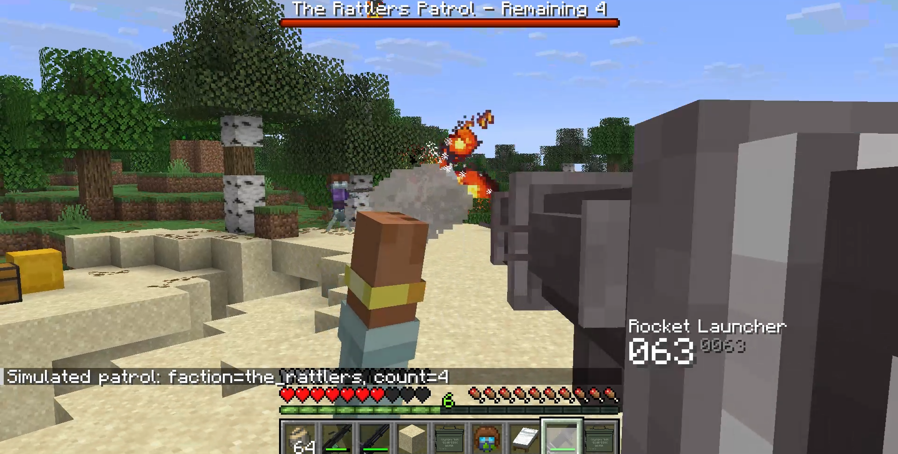

# Just Enough Guns New

A modern fork and port of the Forge 1.20.1 mod Just Enough Guns, bringing vanilla-styled firearms, hostile gunners, faction raids, and late-game aerial threats to newer Minecraft versions.



Just Enough Guns New is based on the original Just Enough Guns project for Forge 1.20.1. This fork ports and continues that gameplay work on modern Fabric and NeoForge versions while keeping the Minecraft-friendly visual style. Weapons use survival crafting progression, magazines, attachments, recoil, spread, overheating, ammo HUD feedback, and server-side combat logic. The current maintained ports support both Fabric and NeoForge across the 1.21.1 and 26.1 lines.

## Screenshots


## Highlights

- Broad firearm lineup: pistols, revolvers, rifles, SMGs, shotguns, machine guns, launchers, bows, flamethrower-style weapons, and special late-game guns.
- Survival progression: ores, scrap processing, workbenches, schematics, blueprints, ammo, magazines, attachments, skins, and repair items.
- Modern gun handling: left-click shooting, right-click aiming, magazine reloads, recoil, movement spread, dynamic crosshair expansion, hit markers, muzzle effects, and bullet trails.
- Heavy weapon behavior: overheating support, cooling feedback, and hold-to-fire rocket launcher timing.
- Hostile gunner mobs: zombie-family, skeleton-family, piglin-family, pillager/vindicator, phantom, ghoul, and parched gunner variants.
- Faction encounters: patrols, faction omen flow, home-triggered raids, raid flares, boss bars, configurable raid waves, and faction-specific blueprint rewards.
- Terror Phantom content: rare sky threat, Bound Terror Phantom guardian variant, phantom gunner summons, configurable death explosions, and End Ship Armada structure encounters.
- Defensive gear: bulletproof helmets and vests, plus armored Joy Harness upgrades.
- Server configuration: tune gunners, raids, UI visibility, dynamic crosshair, hit feedback, Terror Phantom behavior, spread, explosions, and other combat systems.

## Latest Release Notes

Version `1.4.2` focuses on combat readability and tuning:

- Added the right-side combat HUD for gun name, loaded ammo, reserve ammo, magazine counts, timers, overheat state, and hit feedback.
- Added configurable crosshair, dynamic crosshair, hit marker, ammo HUD, and timer HUD visibility.
- Reworked dynamic crosshair spread so movement and firing penalties are represented more clearly.
- Rebalanced weapon spread and heat behavior, including light machine gun cooling and minigun heat gain.
- Added hold-to-fire rocket launcher behavior with charge feedback.
- Added configurable Phantom Gunner death explosions.
- Added Parched gunner support on Fabric, including spawn egg, conversion config, and command support.
- Fixed hit markers so they only appear after successful living-entity bullet damage.

## Supported Versions

| Loader | Minecraft | Java | Mod Version | Required Dependencies |
| --- | --- | --- | --- | --- |
| Fabric | 1.21.1 | Java 21 | 1.4.2 | Fabric API, GeckoLib 4.8.3 |
| NeoForge | 1.21.1-1.21.4 | Java 21 | 1.4.2 | NeoForge 21.1.x, GeckoLib 4.8.3 |
| Fabric | 26.1 | Java 25 | 1.4.2 | Fabric API, GeckoLib 5.5+ |
| NeoForge | 26.1 | Java 25 | 1.4.2 | NeoForge 26.1.x, GeckoLib 5.5 |

Install the Just Enough Guns New file that matches your loader and Minecraft version. Do not mix Fabric and NeoForge builds.

## Controls

For version `1.3.0` and newer:

| Action | Default Input |
| --- | --- |
| Shoot | Left Click |
| Aim down sights | Right Click |
| Reload | R |
| Sneak behavior, where supported | Shift |

Older builds before `1.3.0` used right-click shooting, `F` reload, and `Shift` aiming. If you are updating from an old version, check your keybinds after launch.

## Gameplay Notes

Most guns need the correct ammo or magazine type. Magazine-fed weapons use loaded magazines, while manual and single-item weapons use their matching ammunition directly. Attachments, stocks, grips, sights, skins, badges, and special ammo types are part of the normal progression.

Some world and combat systems are intentionally dangerous when enabled. Gunner mobs, patrols, raids, explosive mobs, and Terror Phantom events can heavily change survival balance. Server owners should review the generated config files before running the mod in a public world.

## Ballistic Armor Interception

Bulletproof helmets and vests use a ballistic interception model for gun damage instead of vanilla Projectile Protection. Each shot resolves an effective armor-piercing value from the ammo type and the gun multiplier:

```
effectiveAP = ammoArmorPiercing * gunArmorPiercingMultiplier
```

On a protected hit, headshots use the bulletproof helmet first. Other protected body hits use the bulletproof vest. If no matching bulletproof armor piece is equipped, gun damage is unchanged.

For the selected armor piece, the damage multiplier depends on whether the shot undermatches or overmatches the armor rating:

```
apRatio = effectiveAP / armorRating

if effectiveAP < armorRating:
    damageMultiplier = undermatchMultiplier * (0.55 + apRatio * 0.45)
else:
    damageMultiplier = overmatchMultiplier * min(1.25, 0.85 + (apRatio - 1.0) * 0.18)
    damageMultiplier = min(damageMultiplier, 0.95)

finalDamage = rawDamage * damageMultiplier
```

Armor durability loss scales with raw damage and AP pressure. Under-matching shots still wear armor down, while over-matching shots punish armor more heavily:

```
pressure = effectiveAP / armorRating

if effectiveAP < armorRating:
    durabilityDamage = rawDamage * (0.65 + pressure * 0.35)
else:
    durabilityDamage = rawDamage * (1.00 + min(1.50, pressure - 1.0) * 0.85)
```

The result is then scaled by the armor slot and armor tier durability multipliers and capped before being applied to the armor item.

## Commands And Config

The mod exposes in-game configuration commands for common server tuning. Availability depends on loader/version branch, but recent builds include controls for areas such as:

- UI: ammo HUD, timer HUD, crosshair, dynamic crosshair, and hit markers.
- Mobs: gunner conversion chances, Parched gunner conversion, Phantom Gunner death explosions, and Terror Phantom behavior.
- Raids: faction patrols, raid wave timing, raid counts, and gunner accuracy scaling.

Config changes should be tested on a copy of the world before using them on a long-running server.

## Credits And License

Just Enough Guns New is a fork and modern Fabric/NeoForge port of the original Just Enough Guns project, which targets Forge 1.20.1.

- Original Just Enough Guns code, design, and assets belong to the original authors.
- Just Enough Guns New porting and maintenance credits in the mod metadata include Rui Mao, MigaMi, and Leander.
- Licensed under GPL-3.0.

Suggestions and bug reports are welcome. Clear reproduction steps, Minecraft version, loader, mod version, dependency versions, and crash logs help much more than vague reports.
