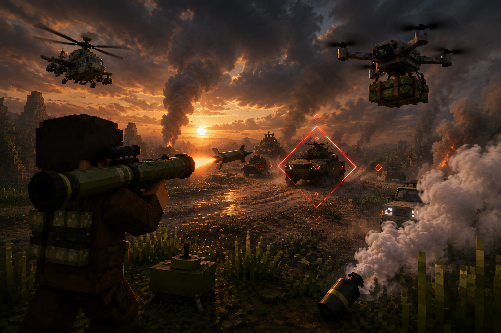

# Just Enough Guns New Wiki

This is the versioned, repository-local guide for **Just Enough Guns New 1.8.1**. English is the reference text; the other pages keep the same sections and links for easier maintenance.

## Choose a language

| Language | Guide |
| --- | --- |
| English (主文档) | [English](en-US.md) |
| 简体中文 | [中文](zh-CN.md) |
| 日本語 | [日本語](ja-JP.md) |
| Deutsch | [Deutsch](de-DE.md) |
| Español | [Español](es-ES.md) |

## Start here

- **New players:** [Quick start](en-US.md#quick-start) · [Controls](en-US.md#controls) · [First-session checklist](en-US.md#first-session-checklist)
- **Server owners:** [Compatibility](en-US.md#compatibility) · [Server administration](en-US.md#server-administration) · [Troubleshooting](en-US.md#troubleshooting)
- **Combat reference:** [Weapons and ammunition](en-US.md#weapons-and-ammunition) · [Vehicles](en-US.md#vehicles) · [Special equipment](en-US.md#special-equipment)
- **Contributors:** [Developer and maintainer links](en-US.md#developer-and-maintainer-links) · [Bug reports](en-US.md#bug-reports)

## Project at a glance

Just Enough Guns New is an unofficial modern Fabric and NeoForge port of the Forge 1.20.1 **Just Enough Guns** project. It combines survival firearms, magazines and attachments with hostile gunners, faction raids, Walkürenritt vehicles, special equipment and late-game aerial threats.

The maintained release line targets Minecraft **1.21.1, 26.2 and 26.3**. Fabric and NeoForge files are separate: install exactly the loader and Minecraft version shown in the compatibility table.

## Page map

| Need | Where to go |
| --- | --- |
| Install the mod | [Quick start](en-US.md#quick-start) |
| Learn the basic loop | [First-session checklist](en-US.md#first-session-checklist) |
| Understand guns and armor | [Weapons and ammunition](en-US.md#weapons-and-ammunition) · [Ballistic protection](en-US.md#ballistic-protection) |
| Operate vehicles | [Vehicles](en-US.md#vehicles) |
| Use drones, C4 or guided launchers | [Special equipment](en-US.md#special-equipment) |
| Tune a server | [Server administration](en-US.md#server-administration) |
| Resolve a crash or mismatch | [Troubleshooting](en-US.md#troubleshooting) |
| Read release history | [Release notes](../../CHANGELOG.md) |

## Maintenance note

When behavior changes, update `en-US.md` first, then keep the translated pages aligned section by section. The language pages document player-facing behavior; branch-specific engineering evidence remains in each module's `docs/` directory.

